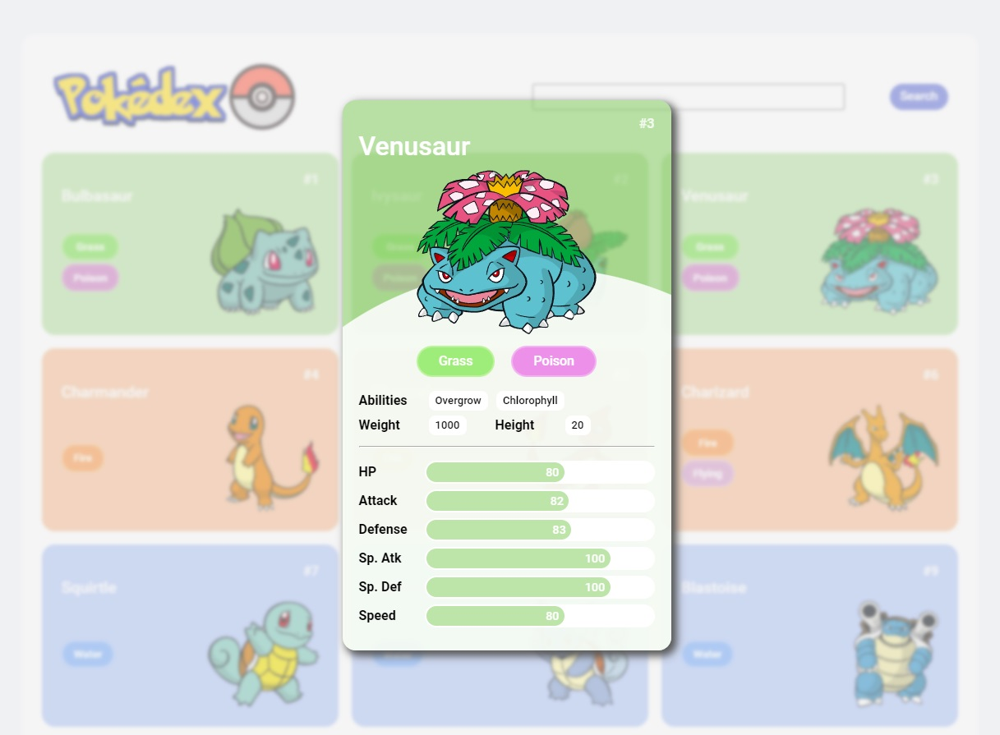

Esse projeto é para fins educacionais e não tem intenção de ferir direitos de Copyrights!

# Javascript + API - Pokedex

### :sunglasses: Santander Bootcamp 2023 - Fullstack Java+Angular!

Esse projeto foi realizado para concluir o módulo "Construindo uma Pokédex com JavaScript" do "Santander Bootcamp 2023 - Fullstack Java+Angular", promovido pela DIO - Digital Innovation One em parceria com o Santander.

O desafio era reproduzir uma pokedex e incluir um card com mais detalhes do pokemon afim de explorar o uso de API em Javascript. Inclui:

- Mobile version
- Barra de busca

Para melhor visualização do resultado, inclui o deploy do projeto:

- [Live version - veja aqui o projeto](https://zesty-taiyaki-849a2f.netlify.app/)

</img>

## 💾 Ferramentas e linguagens

-  Javascript
-  HTML
-  CSS

O projeto foi gerado utilizando a [PokeApi](https://pokeapi.co/)

## 🐼 Autora

Bárbara Damasceno - barbaradamas.dev@gmail.com

[Linkedin](https://www.linkedin.com/in/barbaradamascenodev)
